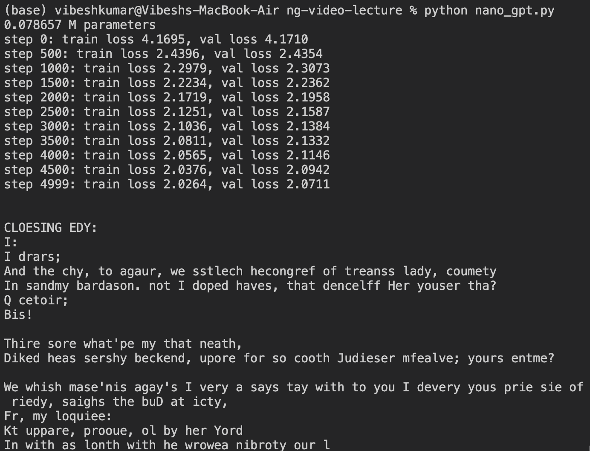

# nanogpt

This is a Python project designed to process and analyze textual data. The project provides functionalities for handling input text and applying transformations or predictions based on language models. Below are the details and usage instructions for the key components of the project.

### Project Structure

1. bigram.py: Contains functions to process text into bigrams, which are sequences of two adjacent elements from a string of words.
2. nano_gpt.py : this is same as gpt.py but will smaller parameter so that one could run this on there own machine with no or less GPU . This is trained on input.txt which smaller as compared to more.txt
3. gpt.py: Implmented GPT decoder part from scratch to predict the next character of a sequene. This is trained on more.txt data(Shakespeare) and require high GPU machine.
I trained it on my DGX server provide by my college for my internship  
4. input.txt: A sample input file containing the text to be processed or analyzed.
5. more.txt: Another text file, possibly containing additional data for testing or training.

### Requirements

To run the project, you'll need Python installed on your machine along with the following libraries:
1. numpy
2. pandas
3. torch (if using GPT models)

You can install the required packages by running:

#### pip install numpy pandas torch

Usage:-
1. Bigram Processing: To use the bigram model, run bigram.py with your input text. This script will generate bigrams from the provided text.

### python bigram.py input.txt

2. GPT Model Processing: To generate predictions or transformations using the GPT model, use gpt.py. The script likely takes an input text file and processes it using a GPT-based model.

### python gpt.py input.txt

## Data Files
1. input.txt: This file contains text that will be processed by the bigram and GPT models.
2. more.txt: This file appears to contain additional test data or text examples. It may be used for further analysis or training.

